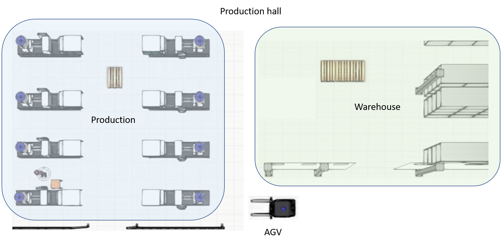
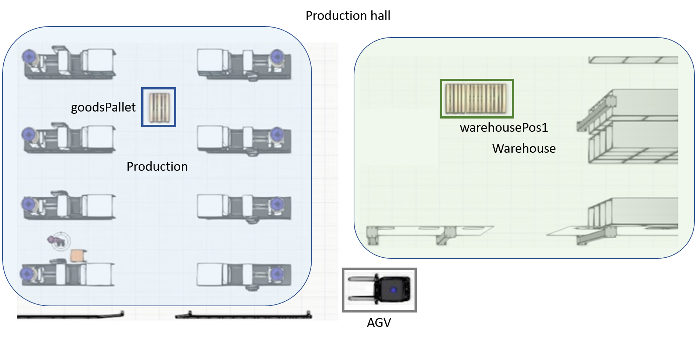
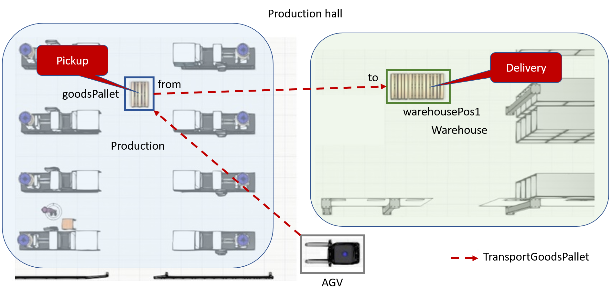
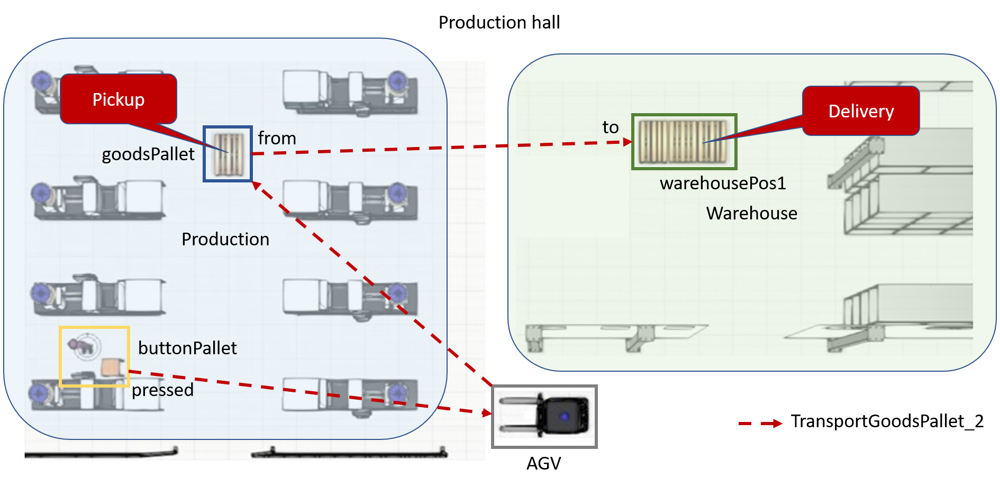
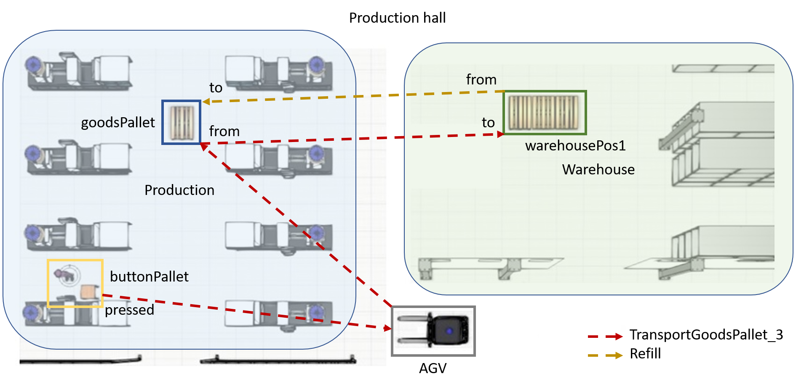

# Logistic Task Language

The Logistic Task Language *(LoTLan)* is a simple, but powerful approach to describe intralogistic materialflow logic. A materialflow process is mainly a transportation task like the pickup *- go to position and get item -* and the delivery *- got to position and unload item*.

## Table of contents

- [Logistic Task Language](#logistic-task-language)
  - [Table of contents](#table-of-contents)
  - [Introduction](#introduction)
    - [Use of Example](#use-of-example)
  - [Primitives](#primitives)
  - [Instances](#instances)
  - [TransportOrderSteps](#transportordersteps)
  - [Tasks](#tasks)
    - [Example Simple Task](#example-simple-task)
    - [Example TriggeredBy Task](#example-triggeredby-task)
    - [Example OnDone Task](#example-ondone-task)
  - [Comments](#comments)
  - [Full Example](#full-example)
  - [Set of allowed chars](#set-of-allowed-chars)
    - [Template](#template)
      - [Examples](#examples)
    - [Instance](#instance)
      - [Examples](#examples-1)
    - [Member Variables](#member-variables)
      - [Examples](#examples-2)
    - [TransportOrderStep](#transportorderstep)
      - [Examples](#examples-3)
    - [Task](#task)
      - [Examples](#examples-4)
    - [Expressions](#expressions)
      - [Examples](#examples-5)
    - [Indentations](#indentations)
      - [Examples](#examples-6)
  - [Execution](#execution)

___

## Introduction

The *LoTLan* consists of 4 different building blocks, that combined with each other describes such a process:

- Primitives
- Instances
- TransportOrderSteps
- Tasks

A *Primitive* is an abstract model for a series of similar objects. It is the blueprint for the representation of real objects in software objects and describes attributes (properties) of the objects. Through the instantiation of such a *Primitive* a *Instance* of a concrete object is created. The *TransportOrderStep* with the help of these *Instances* describes a short procedure. A *Task* then combines *Instances* and *TransportOrderSteps* to a enlarged logical process flow.

### Use of Example

The following documentation of *LoTLan* utilizes the example of a production hall that has an area for storing goods *- the Warehouse -* and an area for the manufacturing *- the Production*. To reduce the complexity only one AGV out of a possible lager fleet is used.

<div style="text-align:center">



*Figure 1: Example floor plan with AGV and production & warehouse area*
</div>

This example shown in the figure above will be expanded in the course of time to explain the individual building blocks of the *LoTLan*.

## Primitives


A *Primitive* summarizes and specifies a set of *Instances*. All *Instances* have the same member variables as their corresponding Primitive. \
Primitives are declared in an additional template file and should not be changed by the user.
Currently there are 4 Primitves implemented:
* Location
* Event
* Time 
* Constraint

The Location *Primitive* is definied as followed:

```text
template Location
    type = ""
    name = ""
End
```

*Location* specifies two member variables, a *type* and a *value*. These attributes can be later on accessed inside the instances. Every TransportOrderStep needs to provide a *Location* Instance.

The *Primitives* *Event* and *Time* are defined as following:

```text
template Event
    name = ""
    type = ""
End

template Time
    timing = ""
End
```

*Event* and *Time* instances can be used in TriggeredBy or FinisheredBy statements.

And finally the Constraint Primitive:

```text
template Constraint
    type = ""
End
```
*Constraint* instances can be used in Tasks


Currently only the following 3 attributes are used in primitives: `name`, `type`, `timing`

## Instances

An *Instance* is the concrete object of a *Primitive*. Such set of *Instances* can be declared by the user and do not share any data other than the definition of their attributes.

As an example, two *Instances* of *Location* could be initiated out of the *Primitive* *Location* (see [Primitives section](#Primitives)):

```text
Location goodsPallet
    type = "pallet"
    name = "productionArea_palletPlace"
End

Location warehousePos1
    type = "pallet"
    name = "warehouseArea_pos1"
End
```

The *Instance* *goodsPallet* has two member variables, a *type* and a *value*. The *type* attribute states *what item is located there* and the *value* the *logical name of this location*.

The *Instances* of an *Event* and *Time* *Primitive* could be defined as following:

```text
Event agvLoadedAtGoodsPallet
    type = "Boolean"
    name = "LightBarrier"
End

Event agvLoadedAtWarehousePos1
    type = "Boolean"
    name = "LightBarrier"
End

Time lunchBreak
    timing = "30 12 * * *"  # Cron format
End
```

Constraint:

```text
Constraint costs
    type = "Integer"
End
```
**Syntax**: The syntax of *Primitives* introduced here is complemented by assigning values to the attributes. These values must be enclosed by `"`. The name has to start with a lowercase character. Each attribute also needs to be prefixed with four spaces (or a `\t`).

Speaking of the example introduced in the [introduction](#Logistic-Task-Language), the formerly shown *Location* *Instances* each define a specific location inside the two areas.

<div style="text-align:center">



*Figure 2: Floor plan with Locations **goodsPallet** and **warehousePos1***
</div>

The figure shows those locations inside the two areas *Warehouse* and *Production*.

## TransportOrderSteps

A *TransportOrderStep* is a *Task*-fragment that contains only a Location and optionally a TriggeredBy, FinishedBy, OnDone or Parameters statement. It can be used by a *Task* as a from/to value.

```text
TransportOrderStep {name}
    Location {location_0}
    TriggeredBy {none|event|time}
    OnDone      {none|followUpTask}
    FinishedBy  {none|event|time}
    Parameters  { param1, param2, ...}
End
```

As an example, two *TransportOrderSteps* are created, both describing a short process:

```text
TransportOrderStep loadGoodsPallet
    Location    goodsPallet
    FinishedBy  agvLoadedAtGoodsPallet == True
    Parameters  liftHeight, unloadDirection
End

TransportOrderStep unloadGoodsPallet
    Location    warehousePos1
    FinishedBy  agvLoadedAtWarehousePos1 == False
    Parameters  unloadDirection
End
```

The *TransportOrderStep* *loadGoodsPallet* defines picking up from the *Location* *goodsPallet*, which is finished when the *Event* *agvLoadedAtGoodsPallet* is True. In the task the user can specify the liftHeight and the unloadDirection at the location. A possible situation could be two storage racks with different layers on different heights. The Task passes over the height and whether the charge should be unloaded left or right.

For the the optional statements TriggeredBy, FinishedBy and OnDone see [Tasks section](#Tasks).

**Syntax**: It is important that the values inside an *TransportOrderStep - End* definition begin with a uppercase character. Each value also needs to be prefixed with four spaces (or a `\t`). The name has to start with an lowercase character. Currently only the following 5 attributes are allowed: `Location`, `TriggeredBy`, `FinishedBy`, `OnDone`, `Parameters`

## Tasks

A *Task* orchestrates different *Instances* via operations to result in a logical process flow. Such a *Task* does not need to describe who is going to transport an item - it is important that the item will be transported.

Generally speaking a *Task* in *LoTLan* describes that a amount of items should be picked up at some location\*s and be delivered to an\*other location\*s. The *Task* can optionally be triggered by an event or by time, can optionally issue a follow up *Task* or be repeated, can optionally be finished by an event and have to meet constraints if given

```text
Task {name}
    Transport
    From        {transportOrderStep_0}
    To          {transportOrderStep_D}
    TriggeredBy {none|event|time}
    OnDone      {none|followUpTask}
    FinishedBy  {none|event|time}
    Repeat      {none = once|1, ..., n|0 = forever}
    Constraints {none|constraint}
End
```

To simplify this down in the following the simplest structure of a *Task* is build and later on extended with optional functionality.

### Example Simple Task

In the simplest form a *Task* in *LoTLan* just describes that an item should be picked up at some location and be delivered to another location:

```text
Task transportGoodsPallet
    Transport
    From        loadGoodsPallet
    To          unloadGoodsPallet
End
```

In terms of the introduced example production hall this *Task* looks like depicted in the following figure.

<div style="text-align:center">



*Figure 3: Floor plan with Task **TransportGoodsPallet***
</div>

This *Task* *transportGoodsPallet* could be done by an AGV, that picks up a pallet **from** *goodsPallet* inside the production area and delivers it **to** the *warehousePos1* in the warehouse area.

### Example TriggeredBy Task

A *Task* can be extended with a *TriggeredBy* statement that activates that *Task* if the case occurs. This statement can be an event like a button press or be something simple as a specific time:

```text

Event buttonPallet
    name = "A_Unique_Name_for_a_Button"
    type = "Boolean"
End

Task transportGoodsPallet_2
    Transport
    From        loadGoodsPallet
    To          unloadGoodsPallet
    TriggeredBy buttonPallet == True
End
```

In this example, the *Task* *transportGoodsPallet_2* will be triggered by the event if the value is equal (*== True*).

In terms of the introduced example production hall this *Task* looks like depicted in the following figure.

<div style="text-align:center">



*Figure 3: Floor plan with Task **transportGoodsPallet_2***
</div>

This *Task* *transportGoodsPallet_2* could be done by an AGV, that picks up a pallet **from** *goodsPallet* inside the production area and delivers it **to** the *warehousePos1* in the warehouse area, when the button *buttonPallet* is pressed.

### Example OnDone Task

A *Task* can be extended with a *OnDone* statement that activates another *Task* when the original one has ended:

```text
TransportOrderStep loadEmptyPallet
    Location    warehousePos1
    FinishedBy  agvLoadedAtWarehousePos1 == True
End

TransportOrderStep unloadEmptyPallet
    Location    goodsPallet
    FinishedBy  agvLoadedAtGoodsPallet == False
End

Task refill
    Transport
    From        loadEmptyPallet
    To          unloadEmptyPallet
End

Task transportGoodsPallet_3
    Transport
    From        loadGoodsPallet
    To          unloadGoodsPallet
    TriggeredBy buttonPallet == True
    OnDone      refill
End
```

In this example another *Task* is introduced. This *Task* *refill* is the same transport as the formerly introduced *transportGoodsPallet*, just the other way around. On the other hand, *transportGoodsPallet_3* here shows now the *OnDone* statement that points to *refill* an runs that *Task* if done. That means a concatenation of *Tasks* is allowed. Exploiting this behaviour infinite *Tasks* can be managed by pointing to each other. So *refill* could also point to *transportGoodsPallet_3* in a *OnDone* statement.

In terms of the introduced example production hall this *Task* looks like depicted in the following figure.

<div style="text-align:center">



*Figure 3: Floor plan with Task **transportGoodsPallet_3** & **refill***
</div>

This *Task* *transportGoodsPallet_3* could be done by an AGV, that picks up a pallet **From** *goodsPallet* inside the production area and delivers it **To** the *warehousePos1* in the warehouse area, when the button *buttonPallet* is pressed. After that the AGV executes the *Task* *refill* and so, it picks up a empty pallet **From** the *warehousePos1* and delivers it **To** the *goodsPallet* location.

## Comments

A comment starts with a hash character (`#`) that is not part of a string literal, and ends at the end of the physical line. That means a comment can appear on its own or at the end of a statement. In-line comments are not supported.

This example shows a mimicked multi-line comment that consists of three `#` that are joined together:

```text
###
# This task shows the usage of comments in LoTLan
###
Task transportPalletTask
    # Comment inside a task
    Transport
    From        loadGoodsPallet  # A pallet
    To          unloadGoodsPallet
    TriggeredBy buttonPallet == True  # More comments
    OnDone      refill
    Repeat      5  # Repeat it 5 times!
End
```

## Full Example

```text
###
# Initiation of the two Locations goodsPallet, warehousePos1 and the three Events agvLoadedAtGoodsPallet, agvLoadedAtWarehousePos1, buttonPallet.
###
Location goodsPallet  # Using the Primitive Location
    type = "pallet"
    name = "productionArea_palletPlace"
End

Location warehousePos1
    type = "pallet"
    name = "warehouseArea_pos1"
End

Event agvLoadedAtGoodsPallet
    type = "Boolean"
    name = "LightBarrier"
End

Event agvLoadedAtWarehousePos1
    type = "Boolean"
    name = "LightBarrier"
End

Event buttonPallet
    name = "A_Unique_Name_for_a_Button"
    type = "Boolean"
End

Constraint costs
    type = "Integer"
End

Constraint emission
    type = "Double"
End

###
# Creation of the TransportOrderSteps loadGoodsPallet and unloadGoodsPallet
###
TransportOrderStep loadGoodsPallet
    Location    goodsPallet
    FinishedBy  agvLoadedAtGoodsPallet == True
    Parameters  liftHeight, unloadDirection
End

TransportOrderStep unloadGoodsPallet
    Location    warehousePos1
    FinishedBy  agvLoadedAtWarehousePos1 == False
    Parameters  unloadDirection
End

TransportOrderStep loadEmptyPallet
    Location    warehousePos1
    FinishedBy  agvLoadedAtWarehousePos1 == True
End

TransportOrderStep unloadEmptyPallet
    Location    goodsPallet
    FinishedBy  agvLoadedAtGoodsPallet == False
End

###
# Creation of a Task that transports from goodsPallet to warehousePos1
###
Task transportGoodsPallet
    Transport
    From        loadGoodsPallet 10, "right"
    To          unloadGoodsPallet "left"
End

###
# Creation of a Task that is triggered if agvLoadedAtGoodsPallet occurs
###
Task transportGoodsPallet_2
    Transport
    From        loadGoodsPallet 5, "right"
    To          unloadGoodsPallet "right"
    TriggeredBy buttonPallet == True
End

###
# Creation of a Task that will call Refill when done
###
Task refill
    Transport
    From        loadEmptyPallet
    To          unloadEmptyPallet
    Constraints emission <= 100
End

Task transportGoodsPallet_3
    Transport
    From        loadGoodsPallet 0, "left"
    To          unloadGoodsPallet "right"
    TriggeredBy buttonPallet == True
    OnDone      refill  # If this Task is done, call Refill
    Constraints (costs <= 100) and (emission <= 50)
End
```
___

## Set of allowed chars

In the following section we use the terms Lower- and Uppercase Strings definied as followed:

*Lowercase String*

starts with a *lowercase char* and after that you can use every letter, number and the char '_'. \
Regex: ```[a-z][a-zA-Z0-9_]* ```

*Uppercase String*: 

same as lowercase except for an *uppercase char* at the beginning. \
Regex: ```[A-Z][a-zA-Z0-9_]*```

### Template

Every *Template* definition starts with a *Template* String. The *Template* name has to be an *Uppercase String*.

#### Examples

Valid Program:
```
Template Location
    type = ""
    name = ""
End
```

Invalid Program:
```
Template Location!!
    type = ""
    name = ""
End

Template location2
    type = ""
    name = ""
End
```

### Instance

Every *Instance* definition of a *Template* type starts with an *Uppercase String* to indicate from which *Template* we want to create an *Instance*. The name of the *Instance* have to be written as *Lowercase String*.

#### Examples

Valid Program:
```
Location pickupItem
    name = "s1_pickup"
    type = "SmallLoadCarrier"
End
```

Invalid Program:
```
Location PickupItem
    name = "s1_pickup"
    type = "SmallLoadCarrier"
End

Location pickup-item
    name = "s1_pickup"
    type = "SmallLoadCarrier"
End
```

### Member Variables
The type has to be *Lowercase String*. The values can either be a *Lowercase* or an *Uppercase String* or a sequence of numbers and the chars '*' and '/'. They are always surrounded by " ". 

Regex for value: ``` '"' [a-zA-Z0-9_]+ '"' | '"' ['*'' ''/'0-9]+ '"' | '""' ```

#### Examples

Valid Program:
```
Location pickupItem
    name = "s1_pickup"
    type = "SmallLoadCarrier"
End
```

Invalid Program:
```
Location pickupItem
    name = s1_pickup
    type = "SmallLoad Carrier"
End

Location pickupItem2
    name = "s1_pickup**"
    type = "SmallLoadCarrier"
End
```

### TransportOrderStep
A *TransportOrderStep* contains the statements *Location* and optionally *Triggered By*,  *Finished By* or *Parameters*.
The *Instance* names should match the corresponding *Instance* so they are *Lowercase Strings* too.

With the *OnDone* Keyword you define a follow up *Task* so the task name should match the corresponding *Task* which is an *Lowercase String*. 
*TriggeredBy*, *FinishedBy* use expressions. To learn more about valid expressions goto [this section](#expressions)

*Parameters*:

#### Examples

Valid Program:
```
TransportOrderStep t1
    Location testitest
    TriggeredBy mitarbeiterButtonDasErFertigIst
    FinishedBy abc == (bce < 5)
    OnDone task
End
```

Invalid Program:
```
TransportOrderStep t1
    MyLocation testitest
    TriggeredBy mitarbeiterButtonDasErFertigIst
    FinishedBy abc == (bce < 5)
    OnDone task
End

TransportOrderStep t2
    Location Location1
    TriggeredBy mitarbeiterButtonDasErFertigIst
    FinishedBy abc == (bce < 5)
    OnDone test
End
```

### Task
*Transport*, *From* and *To* are fixed Keywords. The names of the locations (*From* and *To*) need to be the same as the corresponding locations so they are *Uppercase Strings*.
There are the same optional statements as in TransportOrderStep (TriggeredBy, ...)

#### Examples

Valid Program:
```
Task transport_Task
    Transport 
    From        t1
    To          warehouse
    TriggeredBy palette_1Full == TRUE
End
```

Invalid Program:
```
Task transport_Task
    Transport 
    TriggeredBy palette_1Full == TRUE
    From        t1
    To          warehouse
End

Task transport_Task2
    Transport 
    To          warehouse
    From        t1  
End

Task transport_Task3
    Transport 
    From        t1
    To          warehouse
End
```

### Expressions

An expression can be definied in multiple ways: 
* As attribute
* As a set of nested expressions (have to be surrounded by a left and right parenthesis)
* As comparison of two expressions with a binary operation 
* As a single expression with an unary operation
* As a condition statement (e.g *True*, *False*, but also integers and floats)

Regex:

Attribute: ``` [a-z][a-zA-Z0-9_]+ ``` \
Binary Operation: ``` ['<''>''<=''>=''and''or''==''='] ``` \
Unary Operation: ```! ``` \
Condition Statements: ``` ['True''False''TRUE''FALSE''[0-9]+''[0-9]+( '.' [0-9]+)'] ```


#### Examples

Valid Program:
```
Task transport_Task
    TriggeredBy	palette_3Full == True or 42.42 <= 42.31
    FinishedBy	palette_2Full == FALSE and 40 > 30
End
```

Invalid Program:
```
Task transport_Task
    TriggeredBy	palette_1Full = TRUE
End

Task transport_Task2
    TriggeredBy	palette_2Full == true
    FinishedBy palette_3Full == "TRUE"
End
```


### Indentations

If you are in a block (*Template*, *Instance*, *Task* or *TransportOrderStep*) you need to add an *Indentation* after each New Line of a statement. An *Indentation* can be a tabulator or 3 space characters. It is also not allowed to add an *Indentation* before a Blockstart it must be the first Word after a New Line.

Regex: ```('    ' | '\t')```

#### Examples

Valid Program:
```
Location pickupItem
    name = "s1_pickup"
    type = "SmallLoadCarrier"
End
```

Invalid Program:
```
Location pickupItem
                    name = "s1_pickup"
        type = "SmallLoadCarrier"
End

    Location pickupItem2
    name = "s1_pickup"
    type = "SmallLoadCarrier"
End
```

___

## Execution

To test the grammar you need to do the following:

First: generate Python-Files via:
> java -jar antlr-4.7.2-complete.jar -Dlanguage=Python3 -visitor TaskLexer.g4 TaskParser.g4

Then just simply execute:
> python TaskLanguage.py {path to your file}

to test a given file

or

> python TaskLanguageTest.py (optional) --log

if you want to test *all* Testfiles in the test folder

If the testfiles contain an error it will be printed in the console or in a log file in the logs folder (if --log is given)
